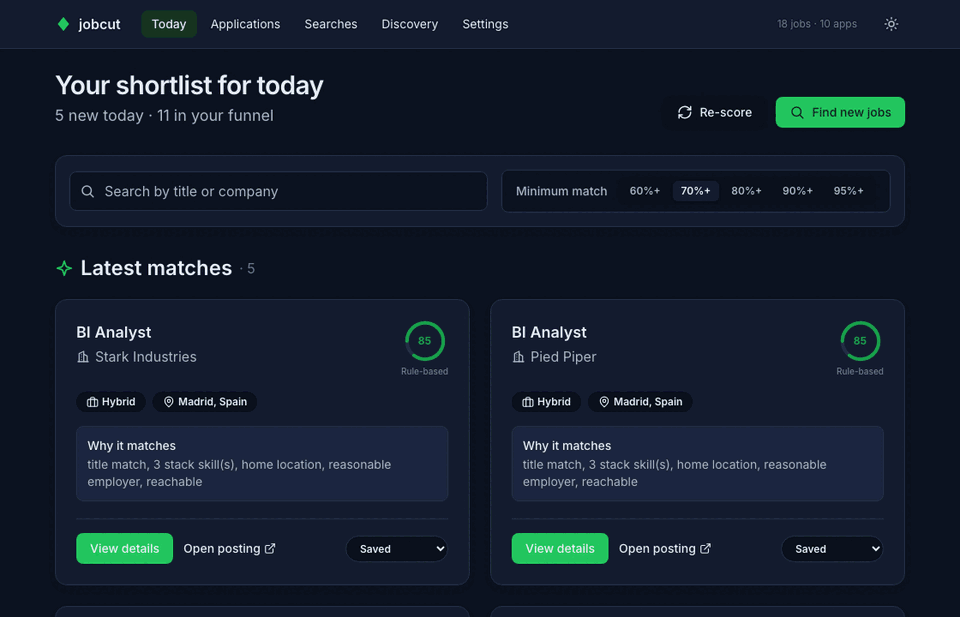
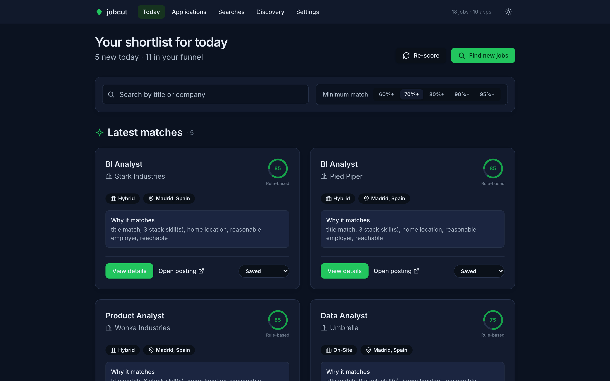
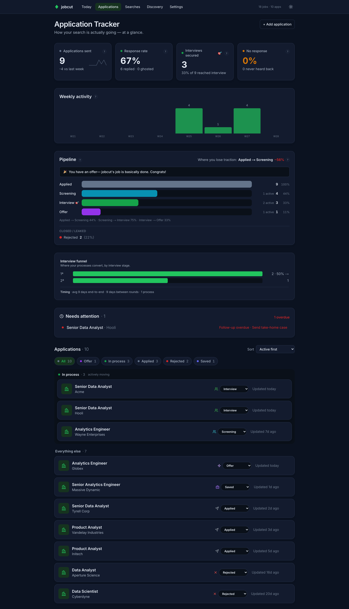
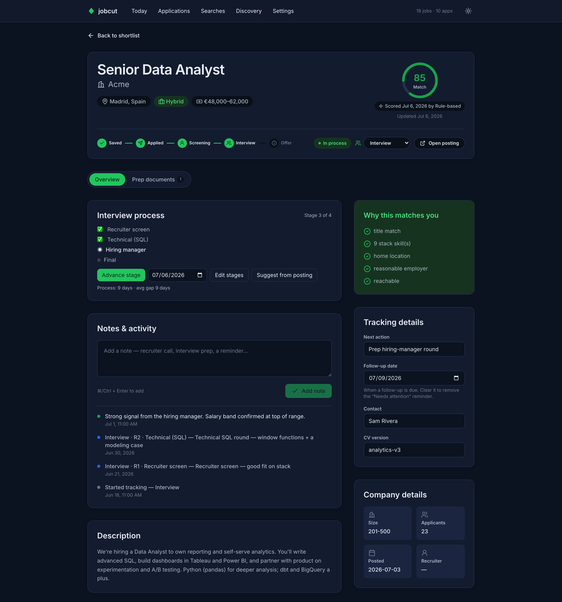
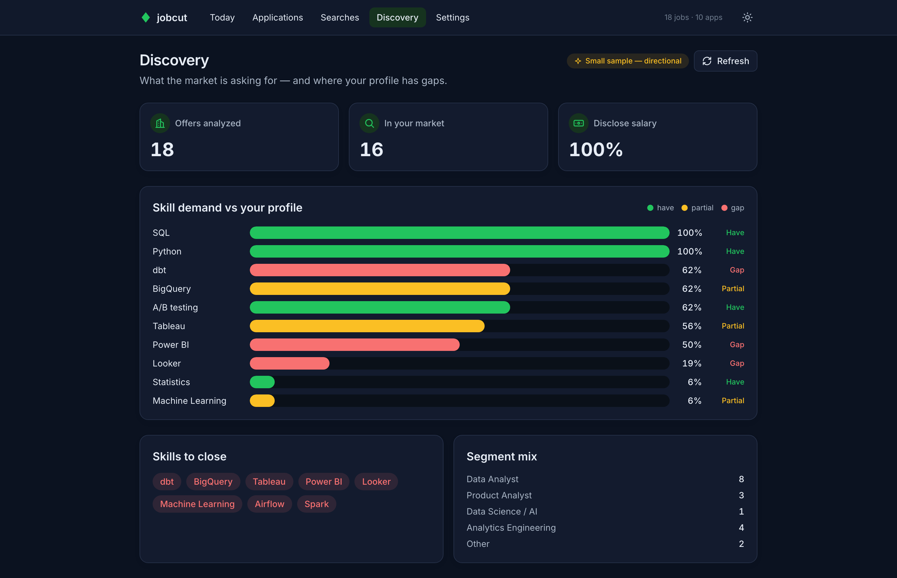
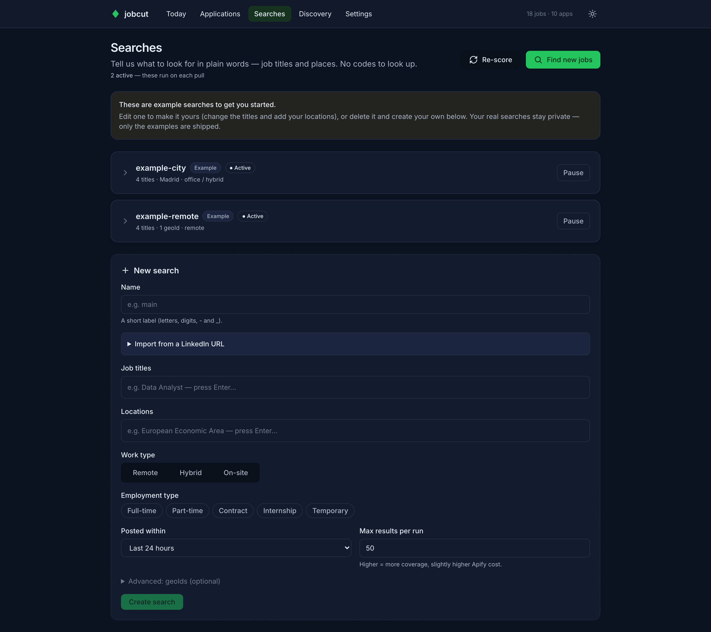
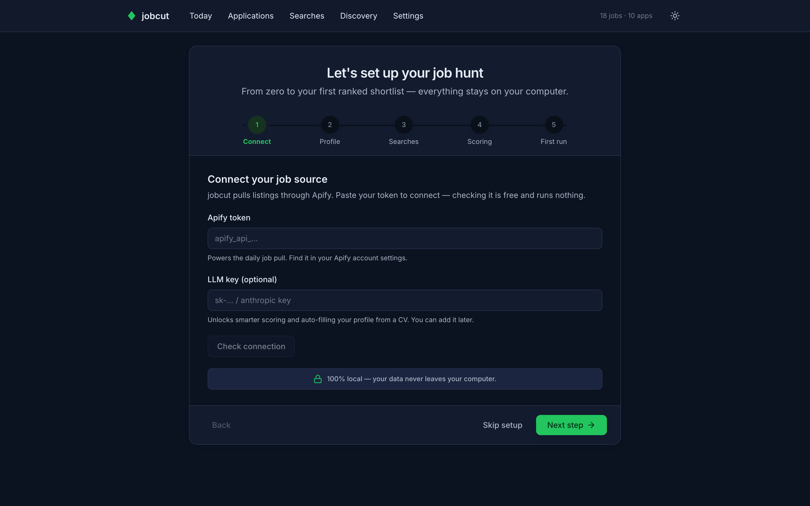
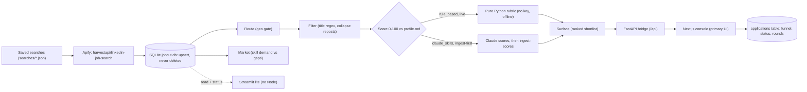

# jobcut

> Wake up to a ranked shortlist of jobs worth your time — not 200 browser tabs.

**`jobcut`** runs entirely on your own machine. Once a day it pulls your saved
LinkedIn searches (via the [Apify](https://apify.com) HarvestAPI scraper),
deduplicates them into a local SQLite database, filters out roles you can't take,
scores the rest **0–100 against your own profile**, and hands you a ranked
shortlist. It **never auto-applies** — that part stays human.

Because it never deletes rows, it also doubles as your own **market dataset**:
which skills are in demand, where, and how that shifts over weeks.

> ⚠️ **Status: pre-release.** The pipeline works end to end and ships a local
> **web console** (Next.js, light **and** dark) over a thin **FastAPI** bridge —
> onboarding, a daily shortlist, an application tracker (status, interview rounds/stages,
> a pipeline funnel, salary bands, prep documents), searches, profile and market gaps —
> launched with a single `jobcut serve`, and updatable in-app. Not yet on PyPI; install
> from this repo with `pip install -e .`.



---

## Screenshots

The local web console (dark theme shown). **All data below is fictional demo content** —
your real jobs, profile, and applications never leave your machine.

| **Today** — your ranked shortlist, scored against your profile | **Application tracker** — funnel, KPIs, and an "act this week" list |
| :---: | :---: |
| [](docs/screenshots/today.png) | [](docs/screenshots/applications.png) |
| **Job detail** — match score, interview process, and full timeline | **Discovery** — what the market asks for vs. your profile gaps |
| [](docs/screenshots/job-detail.png) | [](docs/screenshots/market.png) |
| **Searches** — plain-language job searches, no codes to look up | **Onboarding** — from zero to your first ranked shortlist |
| [](docs/screenshots/searches.png) | [](docs/screenshots/onboarding.png) |

---

## Architecture



- **SQLite is the canonical store** — a single local file (`jobcut.db`). The
  CSV/JSON/Markdown files in `out/` are *exports*, not the engine. SQLite is the
  contract between the pipeline and every frontend.
- **Two frontends, one core.** A thin **FastAPI** bridge imports the `jobcut`
  package and exposes it at `/api`; the **Next.js console** consumes it (primary UI).
  A **Streamlit "lite"** app (no Node) talks to the package directly for read + status
  toggle.
- **User status is its own table.** Application status lives in an `applications` table
  (separate from derived `scores`), so a re-score never clobbers your funnel.
- **Role-agnostic & profile-driven.** Searches and the scoring rubric are *derived from
  your `profile.md`* — nothing is hardcoded to any field (works for a nurse or a data analyst).
- **Two ways to score, both free.** `rule_based` (the **default** — a transparent pure-Python
  rubric: no key, no cost, works offline) or `claude_skills` (your Claude Code / Cowork skill
  reads each job and loads its verdicts via `jobcut ingest-scores`). Pick one in Settings.
- **100% local.** Your data and secrets never leave the machine — except the scraper call
  to Apify (which is only ever triggered with explicit confirmation).

## Pipeline

| Stage   | Module       | What it does |
|---------|--------------|--------------|
| Pull    | `pull.py`    | Runs each saved search (`searches/*.json`) at the Apify actor, flattens the payload. |
| Store   | `db.py`      | Upserts one row per `job_id` into SQLite. Never deletes — a historical accumulator. |
| Route   | `route.py`   | Geo gate (config-driven): is this hireable *for you*? Everything else is market-intel only. |
| Filter  | `filter.py`  | Title regex (config) drops obvious mismatches before scoring; collapses reposts. |
| Score   | `scoring/`   | Scores 0–100 against your profile with a tunable rubric + one-line reason. |
| Surface | `surface.py` | Writes the ranked shortlist to `out/shortlist.md` + `.csv`. |
| Market  | `market.py`  | Skill-demand vs your gaps over the whole DB → `out/market-gaps.md` + dashboard. |

📖 **New here? Read the [full workflow walkthrough](docs/WORKFLOW.md)** — every stage
explained, from the Apify pull to tracking applied roles.

## Design decisions

- **Local-first on SQLite, not a hosted DB.** The only network call is the explicit Apify
  scrape — everything else (your profile, scores, applications) stays on your machine. Cost is
  ~$0 and privacy is the default, at the price of no multi-device sync (an intentional trade).
- **Two scoring backends, both free.** `rule_based` is the *live* floor — a transparent
  pure-Python rubric with no key that works offline; `claude_skills` is *ingest-first* — Claude
  reads each job outside jobcut and loads verdicts via `jobcut ingest-scores`. Picking the
  Claude backend tells `jobcut score` to stand aside rather than quietly rubric-scoring rows
  you expected Claude to judge.
- **Status is its own table.** Application status lives in an `applications` table, separate
  from the derived `scores`, so a re-score never clobbers your funnel.
- **Role-agnostic and profile-driven.** Searches, filters, and the scoring rubric are derived
  from your `profile.md` — nothing is hardcoded to a field, so it works for a nurse or a data
  analyst.
- **It never applies for you.** jobcut finds and ranks; the apply decision stays human by design.
- **Dogfooding as a portfolio angle.** I run jobcut for my own search, and because it never
  deletes rows it doubles as a living dataset of what the market is actually asking for.

## Evaluation

> ⚠️ **Template — not results.** The numbers below are placeholders. Fill them in from your
> own runs; nothing here is a claimed benchmark.

Scoring is the core, so the eval asks: *does the shortlist agree with a human?* Label a sample
of jobs by hand ("would I apply?") and compare the rubric's 0–100 against those labels.

| Metric | What it measures | Result |
|--------|------------------|:------:|
| Precision @ top-N | Of the top-N surfaced jobs, how many you'd actually apply to | _TBD_ |
| Rank correlation | Spearman between rubric score and your hand ranking | _TBD_ |
| Filter false-negatives | Good jobs wrongly dropped by the route/title filters | _TBD_ |
| rule_based vs claude_skills | Agreement between the two backends on the same jobs | _TBD_ |
| Dedupe rate | Duplicate/repost rows correctly collapsed | _TBD_ |

**Method**

1. Pull a run and hand-label ~30–50 jobs as apply / maybe / skip.
2. Score them with `rule_based`, then again with `claude_skills`.
3. Compute precision@N and rank correlation against your labels; tune weights in
   `config/config.json` and re-run.
4. Inspect filtered-out rows for false negatives, and check the dedupe against raw pull counts.

## Quick start

One command sets everything up — it creates an isolated environment, installs
jobcut and its dependencies, builds the web console (if you have Node), and opens
a guided setup wizard. You never touch a virtualenv or edit a config file by hand.

```bash
git clone https://github.com/Nicofragon/jobcut.git && cd jobcut
./setup.sh
```

`setup.sh` finishes by opening the **web console** in your browser, which walks you
through everything — no files to edit by hand:

1. **Connect** — paste your `APIFY_TOKEN` (from [console.apify.com](https://console.apify.com) → Settings → API). It's saved locally to `.env` for you.
2. **Profile** — upload a CV or fill in your roles, skills and dealbreakers (this drives the scoring).
3. **Searches** — set up your job titles + location.
4. **Scoring** — pick a scoring backend (the free `rule_based` one is the default).
5. **First run** — click **Find new jobs** to run your first scrape (~$0.04–0.18 via Apify) and watch the shortlist fill in.

Already set up? Re-open the console any time with `./jobcut serve --open` — or run
`./jobcut shortcut` once to drop a **jobcut app icon** on your Desktop — double-click to
open, no terminal (a real `.app` on macOS, `.desktop` on Linux, `.lnk` on Windows).

> The console build happens once during `setup.sh` (needs Node 20.9+). Without Node
> you still get the full CLI — see below.

<details>
<summary>Prefer the command line (or no Node)?</summary>

```bash
./setup.sh                   # or by hand: python3 -m venv .venv && source .venv/bin/activate && pip install -e '.[api]'
./jobcut init                # scaffolds .env, profile.md, config/, searches/
# edit .env (APIFY_TOKEN) · profile.md · searches/*.json, then:
./jobcut pull && ./jobcut score && ./jobcut surface
./jobcut serve --open        # builds the console on first run
```

**Developing the console** (hot reload, two processes):

```bash
uvicorn jobcut.api.app:app --port 8000     # terminal 1 — the API
cd web && npm run dev                         # terminal 2 — Next dev on :3000
```

**No Node?** Use the **Streamlit "lite"** dashboard (read + status toggle):

```bash
pip install -e '.[dashboard]'
jobcut dashboard
```
</details>

**Platforms.** `setup.sh` targets macOS/Linux (Python 3.11+; Node 20.9+ optional, only
for the web console). On Windows, use WSL or the manual steps above. Schedule the daily
pull with launchd / cron / Task Scheduler — see [`scheduler/`](scheduler/).

## Configuration

Everything lives in your **data dir** (the current directory, or `$JOBCUT_DATA_DIR`):

- **`config/config.json`** — geography (`routing`), the title filter, and scoring
  `weights`. Anything you omit falls back to built-in defaults, so you only set what you change.
- **`profile.md`** — your target roles, real skills, and dealbreakers (read by the scorers).
- **`config/taxonomy.json`** — skills (regex + your have/partial/gap status) for the market report.
- **`searches/*.json`** — one file per saved search = the Apify actor's input. Your real
  ones are git-ignored; ship/keep `example-*.json` as samples.
- **`documents/`** — drop a markdown file with a `jobcut:` frontmatter block here and
  `jobcut serve` auto-imports it as a **prep document** attached to the matching role
  (study notes, interview debriefs). Editing the file updates the doc in place.

### Scoring rubric (`rule_based`, the default)

A transparent rubric you own — edit the weights in `config/config.json`:

```text
+30  title matches a target role          +10  reasonable employer (some size)
+20  stack keywords present               +10  reachable (<50 applicants or a recruiter)
+15  workable location                    −20  a hard requirement you don't meet
+10  profile "nice-to-have" signals       out-of-profile titles (≠ your targets) capped low
```

All of the above — `include_titles`, skill patterns, `signals`, `dealbreakers`,
`routing` — are **derived from your `profile.md`** (Settings → Profile, or
`POST /api/profile/derive`). Nothing is wired to a specific field.

## Using jobcut with Claude

jobcut ships skills so Claude (Cowork / Claude Code) can drive it for you — through
the `jobcut` CLI, never raw SQL. Ask Claude to **run your daily search**, **score
jobs**, tell you **what to apply to / how your pipeline is doing**, **update an
application** (notes, interview rounds, status), **save prep documents** (study notes,
interview debriefs) into a role, **add a job from a URL**, **open the console**,
**summarize the market**, or **update the app**. Setup and the full skill list are in
[`integrations/cowork/`](integrations/cowork/README.md).

| Ask Claude… | Skill |
|-------------|-------|
| "let's work on my job search / is jobcut ready?" | `jobcut` (front door) |
| "run my daily job search" | `jobcut-daily` |
| "score my jobs with Claude" | `jobcut-score` |
| "what should I apply to? / how's my pipeline?" | `jobcut-review` |
| "Acme passed to R3 / add a note to Globex / mark Initech rejected" | `jobcut-track` |
| "save this prep doc / study notes / interview debrief into the Acme app" | `jobcut-docs` |
| "add this job &lt;url&gt; / I applied to this Lever role" | `jobcut-add` |
| "open jobcut / launch the console" | `jobcut-open` |
| "what's the market asking for?" | `jobcut-market` |
| "estimate salaries for these roles" | `jobcut-salary` |
| "update jobcut / I still see the old design" | `jobcut-update` |

## Cost & safety

- Apify is **pay-per-event** (~$0.04–0.18 per run). `jobcut pull --read` re-downloads
  the last run for FREE and is the right default in development.
- `APIFY_TOKEN` lives in `.env` (git-ignored). **Never commit it.**
- The tool **never applies on your behalf.** It finds and ranks; you decide.

## Development

```bash
pip install -e '.[dev]'
pytest                         # the Python suite (pipeline, API, profile derivation)

cd web
npm run lint && npm run build  # console: lint + static export

# end-to-end (browser) smoke — needs the stack running + a browser:
#   1) uvicorn jobcut.api.app:app --port 8000   (seeded data dir)
#   2) npm run dev
npx playwright install chromium && npm run e2e
```

## License

[MIT](LICENSE).
