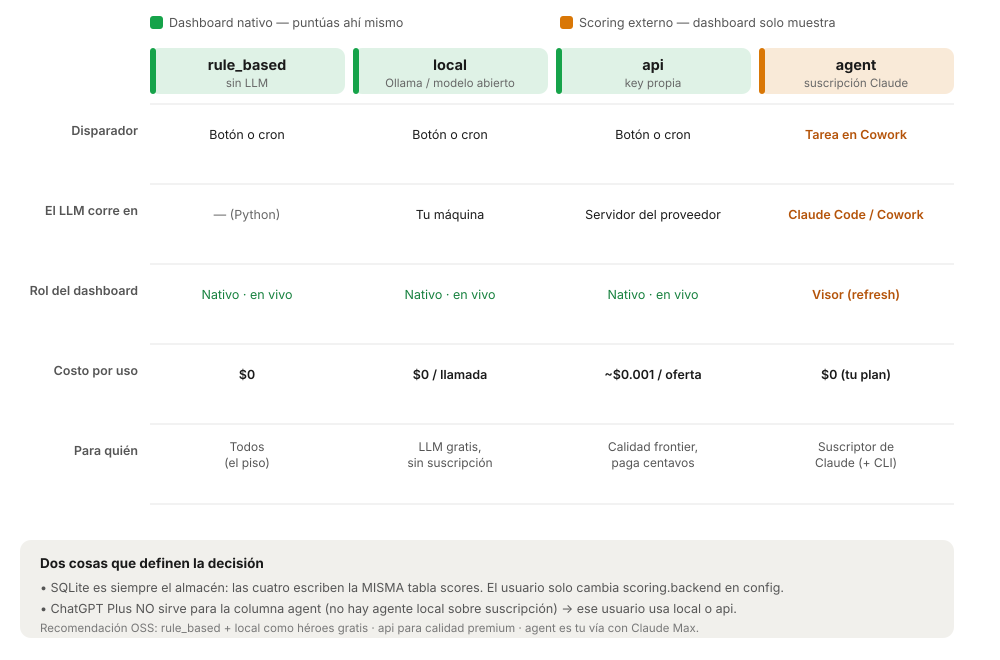

# Diseño: almacenamiento de datos, dashboard y capa de scoring

> **Estado:** Notas de diseño / exploración (base para decisiones futuras).
> **Fecha:** 2026-06-22 · **Autor:** Nicolás (con Claude Cowork)
> **Alcance:** Consolida la discusión sobre (1) dónde viven los datos y cómo
> trabajarlos, (2) cómo se edita desde el dashboard local y cómo se abre, y
> (3) cómo integrar la capa de LLM/scoring — especialmente con **suscripción**
> en vez de **API por llamada**.
>
> Este documento **no decide** nada definitivo: deja las opciones, lo que cada
> una necesita y cómo funcionan, para retomar y construir después.

---

## 0. TL;DR (lo esencial en cinco frases)

1. **SQLite (`jobcut.db`) es y debe seguir siendo la única fuente de verdad.**
   Todo lo demás (Excel, Google Sheets, el dashboard) es una **vista** o un
   **export**, nunca el motor.
2. **El scoring es un backend enchufable**, independiente de dónde viven los
   datos: recibe una oferta + perfil y devuelve `{score, reason}`. Quién pone la
   nota (Python, modelo local, API, o Claude vía suscripción) es intercambiable.
3. **Una suscripción de consumidor (Claude Pro/Max, ChatGPT Plus) NO es una
   API.** No se puede "enchufar" dentro de una app descargable. La única vía
   sancionada para usar la suscripción de forma programática es correr el
   scoring **dentro** de Claude Code/Cowork (OAuth por suscripción).
4. **La plataforma debe ofrecer 4 backends** (`rule_based`, `local`, `api`,
   `agent`) y dejar que cada usuario elija en `config` según lo que tenga. Todos
   escriben la **misma** tabla `scores`, así que conviven sin conflicto.
5. **El camino local (Next.js + FastAPI + SQLite) ya tiene resuelta la edición
   desde el dashboard:** como todo habla con el mismo SQLite, no hay copias que
   reconciliar ni problema de sincronización.

---

## 1. Punto de partida: dos mundos paralelos hoy

Hoy conviven dos implementaciones que hacen cosas parecidas sobre datos
distintos. Reconciliarlas es el hilo conductor de todo el documento.

### Mundo A — La plataforma `jobcut` (lo que se está construyendo)
- **SQLite es el almacén canónico** (`jobcut.db`). Tablas: `jobs` (acumulador
  histórico, una fila por `job_id`, nunca borra), `scores` (sidecar derivado,
  recomputable) y `applications` (verdad escrita por el usuario: estado del
  funnel, separada para que un re-score nunca la pise).
- **Pipeline:** pull (Apify) → store (SQLite) → route → filter → score → surface
  → market.
- **Scoring pluggable** vía la interfaz `Scorer` (`src/jobcut/scoring/`):
  `rule_based` (default, Python puro, sin costo), `llm_api` (con key) y
  `claude_skills` (hoy un **stub**, pensado para delegar a las skills de Claude).
- **Dos frontends, un core:** un puente **FastAPI** fino envuelve el paquete y lo
  consume **Next.js** (UI principal); además un **Streamlit "lite"** sin Node.
  Ver `adr-001-web-pipeline-bridge.md`.
- **Principios declarados:** 100% local, datos/secretos nunca salen del equipo
  (excepto la llamada a Apify); open-source para cualquiera; reuso del motor
  Python; una sola fuente de verdad del esquema.

### Mundo B — La skill de Cowork (lo que corre hoy, en producción personal)
- Skill `job-scraper` + una **tarea programada en Claude Cowork**.
- Lee/escribe un **Excel** (`jobs_database.xlsx`) en otra carpeta.
- El **scoring lo hace Claude** (el LLM de Cowork) leyendo la columna
  `description` con una rúbrica escrita en la skill — usando la **suscripción**,
  sin costo de API por llamada.

> **La reconciliación (resumen):** el Mundo B es, de hecho, el backend
> `claude_skills` del Mundo A — solo que apuntando a Excel en vez de a SQLite.
> El plan es que ambos escriban la misma SQLite. Ver §5.6.

---

## 2. Principio rector: SQLite es la fuente de verdad; el resto son vistas

La regla que ordena todas las decisiones de este documento:

> **El dato vive en SQLite. Excel, Google Sheets y el dashboard son espejos o
> exports. El scoring le habla a SQLite, no al dashboard.**

Esto convierte preguntas que parecían difíciles ("¿cómo reconcilio el LLM con el
dashboard?") en triviales: el dashboard no es el dueño del dato; solo lo lee y lo
escribe a través del mismo SQLite.

---

## 3. Trabajar los datos en herramientas externas (Excel / Google Sheets)

### 3.1 El problema concreto
- Excel instalado **sin licencia de pago** → solo lectura sobre `.xlsx`.
- Se quería poder **editar** las hojas sin pagar Excel.

### 3.2 Opciones para editar sin licencia de Excel
- **Google Sheets (gratis, recomendado para edición manual):** subir el `.xlsx` a
  Drive y editarlo en el navegador. Se puede editar en "modo Excel" o convertir a
  formato Sheets nativo (Archivo → Guardar como Hoja de cálculo de Google).
  *Caveat:* al convertir a nativo, macros/funciones muy específicas de Excel
  pueden no traducirse; para datos/fórmulas normales no hay diferencia.
- **LibreOffice Calc (gratis, escritorio):** abre/edita `.xlsx` con escritura
  completa, sin navegador.
- **Excel para la web (gratis):** versión web en office.com con cuenta Microsoft.

### 3.3 Sincronización local ↔ nube (si se mantiene un `.xlsx`)
- **No existe** sync automático entre un `.xlsx` local y una Hoja de Google
  **nativa** (son objetos distintos).
- **Google Drive para Escritorio** sí sincroniza una carpeta local → Drive
  automáticamente, **pero el archivo se queda como `.xlsx`** (Sheets lo abre en
  modo Excel). Si se convierte a nativo, se rompe el vínculo con el archivo local.
- Conclusión: para sincronización automática, mantener `.xlsx`; para todas las
  funciones de Sheets, convertir y trabajar solo en la nube (una sola copia).

> **Importante para este proyecto:** trabajar en Excel/Sheets es una solución
> *manual* y queda **fuera del camino canónico** (SQLite). Sirve como vista
> rápida o export, no como motor. La dirección elegida es el **dashboard local**
> (§4) sobre SQLite.

---

## 4. Dashboard local: cómo se edita y cómo se abre

### 4.1 El patrón de escritura (ya construido)
El dashboard **nunca** toca SQLite ni archivos directamente. Siempre pasa por
tres capas:

```
React (dashboard)  →  FastAPI (bridge)  →  paquete jobcut  →  SQLite / archivos
   web/lib/api.ts       api/routers/*.py      db.py · profile.py     (única verdad)
```

**Por esto el camino local no tiene problema de sincronización:** cuando el
dashboard habla con el mismo SQLite vía FastAPI, **no hay copia que reconciliar**.
Editar un estado es una escritura directa a la fuente de verdad.

### 4.2 Lo que YA está cableado en el repo
- **Estado de una oferta:** `StatusSelect.tsx` → `setStatus()` →
  `PUT /api/applications/{job_id}` → `db.set_application_status()` → tabla
  `applications`. Con update optimista en React.
- **Perfil:** `profile/page.tsx` (textarea de `profile.md`) → `putProfile()` →
  `PUT /api/profile` → escribe el archivo y re-deriva searches/rúbrica
  (no destructivo salvo `force=true`).
- **Preferencias (pesos del scoring):** misma página → `putConfig()` →
  `PUT /api/config` → escribe `config/config.json`.
- **Credenciales:** `PUT /api/credentials` → `.env`.
- **Searches CRUD:** crear/editar/borrar.
- **Disparar el pipeline desde la web:** `startRun` → `POST /api/runs` con
  progreso en vivo por **SSE**.

### 4.3 Receta para añadir CUALQUIER cosa editable nueva (3 lugares)
1. Función en el paquete que escriba la verdad (ej. `db.set_application_status`).
2. Endpoint en el router que la exponga (ej. `PUT /applications/{id}`).
3. Función tipada en `web/lib/api.ts` + un control de UI que la llame.

*Pulido pendiente:* el vocabulario de estados está duplicado (`StatusSelect.tsx`
los hardcodea aunque la API ya expone `/applications/statuses`) → riesgo de drift;
idealmente el componente los lee de la API. La edición de perfil es un textarea de
markdown crudo; preferencias estructuradas (salario, ubicación, dealbreakers con
validación) serían UI nueva (la plumbing ya existe).

### 4.4 Cómo abrir el dashboard
El build ya existe (`web/out`). Desde la raíz del proyecto:

```bash
source .venv/bin/activate
jobcut serve --open      # API + consola en http://127.0.0.1:8000, abre el navegador
```

Otras formas:
- **Desarrollo (tocar el frontend):** `jobcut serve` (API :8000) + `cd web &&
  npm run dev` (UI :3000, hot-reload).
- **Streamlit lite (sin Node):** `jobcut dashboard`.

### 4.5 ¿La sincronización del dashboard es live?
Comportamiento actual: **"fresco al cargar, no auto-live".** No hace falta cerrar
y reabrir; **un refresh del navegador basta**.
- **Inmediato:** cada fetch usa `cache: "no-store"` (nunca datos viejos). Tus
  acciones (cambiar estado, guardar perfil) se reflejan al instante. El progreso
  de un run llega **en vivo por SSE**.
- **No se actualiza solo:** las páginas cargan datos en `useEffect` al montar;
  **no hay polling**. Si la DB cambia por fuera (cron, otra pestaña, Cowork), la
  página abierta no se entera sola hasta un F5 / re-navegación.
- **Mejora futura (opcional):** polling ligero o SSE en los endpoints de datos
  (shortlist/funnel) para "live de verdad" sin F5 — encaja sin fricción.

### 4.6 De "abrir con un comando" a "app de escritorio"
- **Ahora (ya creado):** `scripts/jobcut-dashboard.command` — lanzador de doble
  clic en macOS. Arrastrarlo al Escritorio; primer uso: clic derecho → Abrir
  (Gatekeeper). Abre una ventana de Terminal mientras el server corre (cerrarla =
  apagar). Para ícono propio: envolver con Automator como "Aplicación".
- **End-state — Tauri (ya anotado en ADR-001 como *Later*):** empaqueta `web/out`
  en una ventana nativa (WebView), arranca uvicorn como *sidecar* al abrir y lo
  mata al cerrar → `.app`/`.dmg` real con ícono, sin Terminal ni navegador.
- **Punto medio sin código — PWA:** con el server corriendo, Chrome/Edge →
  *Instalar app* en `localhost:8000` → ventana propia con ícono.
- **Alternativas:** `pywebview` (100% Python) o Electron (más pesado que Tauri).

---

## 5. La capa de scoring y la integración con LLM (el corazón)

### 5.1 El concepto que ordena todo
"**Dónde viven los datos**" y "**qué hace el scoring**" son **ejes
independientes**. SQLite es solo el almacén. El scoring es un backend enchufable
que recibe `(job, profile)` y devuelve `JobScore{score, reason}` (interfaz
`Scorer` en `scoring/base.py`). Quién pone la nota es intercambiable.

### 5.2 Verdad dura: una suscripción NO es una API
Verificado (junio 2026): las suscripciones de consumidor (Claude Pro/Max, ChatGPT
Plus) y la API son **productos separados con facturación separada**. Tener Claude
Pro **no** da créditos de API ni abarata la API; lo mismo ChatGPT Plus. Por tanto:

> **No se puede "enchufar la suscripción" dentro de una app descargable como
> endpoint de modelo.** No hay key, no hay puente soportado, los términos no lo
> permiten.

### 5.3 La excepción sancionada: agentes sobre suscripción (solo Claude hoy)
**Claude Code (y Cowork) sí autentican con la suscripción Pro/Max vía OAuth**, en
vez de una API key — consumen el *cupo del plan*, sin cobro por llamada. La app no
"llama" a la suscripción: el scoring corre **dentro** del producto-agente, que
luego escribe la base. *Importante:* si existe `ANTHROPIC_API_KEY` en el entorno,
Claude Code usaría la API (con cargo) en vez del plan — hay que loguear solo con
la cuenta de suscripción.

> **ChatGPT Plus no tiene equivalente** (no hay agente local sobre suscripción que
> puntúe archivos y escriba la base). Un suscriptor de ChatGPT que no quiera pagar
> por llamada debe usar un **modelo local** o una **API key**. Asimetría real
> entre Claude y OpenAI hoy.

### 5.4 Los cuatro backends (la abstracción a construir)

| Backend | Quién puntúa | Necesita | Costo/uso | Dashboard | Para quién |
|---|---|---|---|---|---|
| `rule_based` | Python determinista | nada | $0 | nativo, en vivo | todos (piso) |
| `local` | modelo abierto (Ollama/LM Studio) en `localhost` | instalar Ollama + un modelo | $0/llamada (usa tu HW) | nativo, en vivo | LLM gratis, sin suscripción ni key |
| `api` | API del proveedor (Anthropic/OpenAI/…) | API key propia | ~$0.001/oferta | nativo, en vivo | calidad frontier, paga centavos |
| `agent` (`claude_skills`) | Claude dentro de Code/Cowork | suscripción Claude + Claude Code/Cowork | $0 (cupo del plan) | **visor** (refresh) | suscriptor de Claude (Nicolás) |

Todos escriben la **misma tabla `scores`** por el mismo `upsert`. El usuario solo
cambia `scoring.backend` en `config`. Se shippean los cuatro y cada quien elige.

### 5.5 User journeys (el "día en la vida" de cada opción)



**`rule_based`** — *Setup:* instalar, escribir `profile.md`. *Cada día:* botón o
cron → Python puntúa → SQLite → shortlist al instante. *Costo:* $0.

**`local` (Ollama)** — *Setup:* descargar Ollama, `ollama pull llama3.1`, elegir
backend `local`; la app detecta `localhost:11434` (endpoint compatible con
OpenAI). *Cada día:* igual, el scoring lo hace el modelo local (más lento, gratis,
privado). *Costo:* $0/llamada. **Héroe del local-first.**

**`api` (key propia)** — *Setup:* crear API key en console.anthropic.com /
platform.openai.com, pegar en Ajustes, validar. *Cada día:* el scoring llama a la
API por oferta (rápido, frontier). *Costo:* fracciones de centavo/oferta.

**`agent` (suscripción)** — dos formas:
- **Forma A — Tarea programada en Cowork (la de Nicolás hoy):** Cowork se dispara,
  lee de SQLite las ofertas sin score, Claude las puntúa con su criterio (cupo del
  plan), escribe `scores`. El **dashboard es visor**: se abre aparte para triar y
  cambiar estados.
- **Forma B — Claude Code headless (para que el botón del dashboard funcione):**
  el backend lanza `claude -p` en modo headless (autenticado por suscripción) →
  puntúa → escribe SQLite → refresca. Específico de Claude, requiere CLI logueado,
  suma latencia.

> **Consecuencia de UX que conviene decidir a propósito:** `local` y `api` son
> **dashboard nativo de punta a punta** (puntúas con un botón ahí mismo). La
> opción de **suscripción invierte el flujo**: el cerebro corre en Cowork/Code y
> el dashboard queda como **visor**.

### 5.6 Reconciliar Cowork ↔ SQLite (migrar el Mundo B al Mundo A)
- **¿Cowork puede usar SQLite en la tarea programada? Sí.** `sqlite3` es librería
  estándar; el `.db` es un archivo en la carpeta montada; la tarea ya corre
  Python (`update_jobs_db.py`). Solo se cambia el destino Excel → SQLite.
- **No escribir SQL crudo desde la skill:** duplica el esquema (drift). Mejor que
  la skill llame al paquete (`from jobcut import db`) o a un comando fino tipo
  `jobcut ingest-scores <json>`. **Una sola autoridad del esquema.**
- **Secuencia pull → score:** primero `jobs`, luego `scores`. WAL aguanta
  lectores; dos escritores se serializan → mantenerlos ordenados.
- **Un solo scheduler:** si la tarea de Cowork y el cron de `scheduler/` scrapean
  los dos, se **paga Apify dos veces**. Decidir quién es dueño del run diario.
- **Migración única:** `jobs_database.xlsx` → SQLite, y repuntar la skill al `.db`.

---

## 6. Decisiones y recomendaciones (estado actual del pensamiento)

- **Almacén:** SQLite es la fuente de verdad. **No cambiar.** (Confirma ADR-001.)
- **Dashboard:** el camino local (Next.js + FastAPI) es el más limpio para
  escrituras y **no tiene problema de sync**. Mantenerlo, pero evitar
  sobre-construirlo; Streamlit-lite es un fallback 100% local válido.
- **Scoring:** construir la abstracción de **4 backends**. Recomendación:
  - **OSS hero:** `rule_based` + `local` (Ollama) → ambos gratis y locales.
  - **Premium:** `api` (BYO key) para calidad frontier por centavos.
  - **Nicolás:** `agent`/`claude_skills` con Claude Max (gratis, top calidad).
- **Suscripción:** sirve **solo** vía Claude Code/Cowork. No diseñar nada que
  asuma "la app usa mi suscripción" directamente.

---

## 7. Qué falta construir (próximos pasos / action items)

- [ ] **Abstracción de proveedor de scoring:** `Scorer` con los 4 backends +
      detección de capacidades (¿Ollama en localhost? ¿API key? ¿corre dentro de
      Cowork?) + selección por `config` con fallback a `rule_based`.
- [ ] **Implementar `local`** (cliente Ollama/OpenAI-compatible) como backend.
- [ ] **Implementar `claude_skills.py`** (hoy stub) + comando
      `jobcut ingest-scores <json>` para que Cowork escriba sin SQL crudo.
- [ ] **Repuntar la skill `job-scraper`** de Cowork: leer/escribir SQLite en vez
      de `jobs_database.xlsx`.
- [ ] **Migración única** `jobs_database.xlsx` → SQLite.
- [ ] **Decidir el scheduler único** (Cowork vs cron) para no pagar Apify doble.
- [ ] **(Opcional UX)** dashboard auto-refrescante (polling/SSE en shortlist y
      funnel); leer el vocabulario de estados desde la API; formulario de
      preferencias estructuradas.
- [ ] **(Later)** empaquetado con **Tauri** para ícono nativo de escritorio.

---

## 8. Glosario rápido
- **Backend de scoring:** implementación de la interfaz `Scorer` que pone la nota.
- **Field ownership:** cada columna tiene un único escritor → elimina conflictos
  de escritura (clave para que un re-score nunca pise el estado del usuario).
- **System of record:** la bodega / fuente de verdad (SQLite), frente a las vistas
  (el dashboard).
- **BYO key:** "bring your own key" — el usuario pone su propia API key.
- **Agent/OAuth subscription:** correr el LLM dentro de Claude Code/Cowork
  autenticado con la suscripción (sin cargo por llamada).

## 9. Fuentes
- [Claude Pro/Max vs API — por qué se pagan aparte (Anthropic Help Center)](https://support.claude.com/en/articles/9876003-i-have-a-paid-claude-subscription-pro-max-team-or-enterprise-plans-why-do-i-have-to-pay-separately-to-use-the-claude-api-and-console)
- [Usar Claude Code con tu plan Pro o Max (Anthropic Help Center)](https://support.claude.com/en/articles/11145838-use-claude-code-with-your-pro-or-max-plan)
- Referencias internas: `docs/adr-001-web-pipeline-bridge.md`,
  `README.md`, `src/jobcut/scoring/`, `src/jobcut/api/routers/`.
